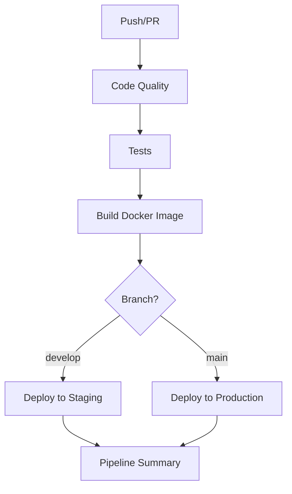

# 🚀 GitHub Actions CI/CD Pipeline

This document describes the modular CI/CD pipeline for VulnTrack, implemented using GitHub Actions. The pipeline is broken down into specialized, focused workflows that are easier to maintain, debug, and understand.

## 📁 Workflow Structure

### 🎯 Main Orchestrator
- **`.github/workflows/main.yml`** - Main pipeline orchestrator that calls other workflows

### 🔍 Specialized Workflows
- **`.github/workflows/code-quality.yml`** - Ruff formatting/linting, mypy type checking, security scans
- **`.github/workflows/test.yml`** - Unit tests, integration tests, coverage reporting
- **`.github/workflows/build.yml`** - Docker image building and container security scanning
- **`.github/workflows/deploy-simple.yml`** - Deployment to staging/production environments

### 📜 Legacy Workflows
- **`.github/workflows/ci-cd.yml`** - Original monolithic workflow (kept for reference)
- **`.github/workflows/deploy.yml`** - Original complex deployment workflow

## 🏗️ Pipeline Flow



## ✅ Benefits of Modular Approach

### 🔧 **Maintainability**
- **Single Responsibility**: Each workflow has one clear purpose
- **Easier Debugging**: Issues are isolated to specific components
- **Independent Updates**: Modify one workflow without affecting others

### 🚀 **Reusability**
- **Workflow Calls**: Workflows can be called from other workflows
- **Parameterization**: Pass different inputs for different environments
- **Consistency**: Same workflow logic across multiple triggers

### 📊 **Visibility**
- **Clear Naming**: Easy to identify which component failed
- **Focused Logs**: Smaller, more focused log outputs
- **Better Reporting**: Individual status for each pipeline stage

### ⚡ **Performance**
- **Parallel Execution**: Independent workflows can run in parallel
- **Selective Runs**: Only run necessary workflows based on changes
- **Efficient Caching**: More granular caching strategies

## 🎮 How to Use

### 🔄 Automatic Triggers
The main workflow (`main.yml`) automatically triggers on:
- **Push** to `main` or `develop` branches
- **Pull Requests** to `main` or `develop` branches

### 🎯 Manual Triggers
Individual workflows can be triggered manually:

```bash
# Trigger code quality check only
gh workflow run code-quality.yml

# Trigger tests only
gh workflow run test.yml

# Trigger build only
gh workflow run build.yml
```

### 🔧 Debugging Individual Components

If a specific component fails, you can:

1. **Check the specific workflow logs**
2. **Run only that workflow** to isolate the issue
3. **Fix the issue** without running the entire pipeline
4. **Re-run just that component** to verify the fix

## 📋 Workflow Details

### 🔍 Code Quality (`code-quality.yml`)
- **Ruff** formatting and linting (replaces Black/flake8/isort)
- **mypy** type checking
- **Bandit** security scanning
- **Safety** dependency vulnerability check

**Key Features:**
- Uses Poetry for dependency management
- Caches virtual environment for faster runs
- Generates JSON reports for all tools
- Comments on PRs with quality results
- Uploads artifacts for debugging

### 🧪 Tests (`test.yml`)
- **Unit Tests** with pytest and coverage
- **Integration Tests** with API testing
- **Services**: PostgreSQL, MongoDB, Redis
- **Coverage Reporting** to Codecov

**Key Features:**
- Parallel test execution where possible
- Database services for integration testing
- Newman/Postman collection testing
- Coverage reports in multiple formats
- Test result artifacts

### 🐳 Build (`build.yml`)
- **Multi-platform** Docker builds (amd64, arm64)
- **Container Security Scanning** with Trivy
- **Image Testing** with basic health checks
- **Registry Push** to GitHub Container Registry

**Key Features:**
- Multi-architecture builds
- Security vulnerability scanning
- Container health testing
- Automatic tagging strategy
- Build caching for performance

### 🚀 Deploy (`deploy-simple.yml`)
- **Environment-specific** deployments
- **Health Checks** post-deployment
- **Configurable** for different deployment strategies
- **Summary Reporting** with deployment details

**Key Features:**
- Reusable workflow with parameters
- Environment protection rules
- Post-deployment verification
- Flexible deployment commands
- Rollback capabilities

## 🔧 Configuration

### 📝 Required Secrets
Set these in your GitHub repository settings:

**Testing:**
- `GEMINI_API_KEY_TEST` - Gemini API key for testing
- `BRAVE_SEARCH_API_KEY_TEST` - Brave Search API key for testing

**Deployment (if using Kubernetes):**
- `KUBECONFIG_STAGING` - Base64 encoded kubeconfig for staging
- `KUBECONFIG_PRODUCTION` - Base64 encoded kubeconfig for production

### 🌍 Environments
Create these environments in GitHub with appropriate protection rules:
- **`staging`** - For develop branch deployments
- **`production`** - For main branch deployments

### ⚙️ Workflow Variables
Key environment variables used across workflows:
- `PYTHON_VERSION: '3.11'` - Python version for consistency
- `NODE_VERSION: '18'` - Node.js version for API testing
- `REGISTRY: ghcr.io` - Container registry
- `IMAGE_NAME: ${{ github.repository }}` - Docker image name

## 🔄 Migration from Monolithic

The original `ci-cd.yml` has been preserved for reference. The new modular approach provides:

- ✅ **Same functionality** with better organization
- ✅ **Improved error isolation** and debugging
- ✅ **More flexible** workflow triggers
- ✅ **Better maintainability** for future changes

### 📋 Migration Steps
1. **Test new workflows** in a feature branch
2. **Verify all functionality** works as expected
3. **Update branch protection rules** to use new workflows
4. **Archive old workflows** once confident in new setup

## 🎯 Customization Examples

### 🔧 Adding a New Tool to Code Quality
```yaml
- name: 🔍 Custom Linter
  run: |
    poetry run custom-linter app/ --output=json
  continue-on-error: true
```

### 🧪 Adding New Test Types
```yaml
- name: 🎭 E2E Tests
  run: |
    poetry run playwright test
  continue-on-error: false
```

### 🐳 Custom Build Arguments
```yaml
build-args: |
  ENVIRONMENT=production
  VERSION=${{ github.sha }}
```

### 🚀 Different Deployment Strategies
```yaml
# Blue-Green Deployment
- name: 🔄 Blue-Green Deploy
  run: |
    kubectl set image deployment/app-green app=${{ inputs.image-tag }}
    kubectl patch service app-service -p '{"spec":{"selector":{"version":"green"}}}'
```

## 🛠️ Development Workflow

### 🔀 Feature Development
```bash
# 1. Create feature branch
git checkout -b feature/new-feature

# 2. Make changes
# Code quality and tests run on every push

# 3. Create PR
# Full pipeline runs including integration tests

# 4. Merge to develop
# Triggers staging deployment

# 5. Merge to main (via PR)
# Triggers production deployment
```

### 🐛 Debugging Failed Workflows
```bash
# 1. Check workflow logs in GitHub Actions tab
# 2. Download artifacts for detailed reports
# 3. Run specific workflow manually for testing
gh workflow run code-quality.yml --ref feature-branch

# 4. Fix issues and re-run
git commit -m "fix: resolve linting issues"
git push
```

## 📊 Monitoring and Metrics

### 📈 What to Monitor
- **Pipeline Success Rate**: Overall success percentage
- **Build Times**: Track performance over time
- **Test Coverage**: Ensure coverage doesn't decrease
- **Security Vulnerabilities**: Monitor Trivy/Bandit results
- **Deployment Frequency**: How often you deploy

### 🔍 Available Reports
- **Code Quality**: Ruff, mypy, bandit, safety reports
- **Test Results**: JUnit XML, coverage reports
- **Security Scans**: Trivy SARIF, bandit JSON
- **Performance**: Build times, test durations

## 🎯 Next Steps

1. **Test the new workflows** with your repository
2. **Customize deployment logic** in `deploy-simple.yml`
3. **Add environment-specific secrets** in GitHub settings
4. **Remove or archive** old workflows once validated
5. **Extend workflows** as needed for your specific requirements

## 📚 Additional Resources

- [GitHub Actions Documentation](https://docs.github.com/en/actions)
- [Workflow Syntax](https://docs.github.com/en/actions/using-workflows/workflow-syntax-for-github-actions)
- [Reusable Workflows](https://docs.github.com/en/actions/using-workflows/reusing-workflows)
- [Security Hardening](https://docs.github.com/en/actions/security-guides)
- [Environment Protection Rules](https://docs.github.com/en/actions/deployment/targeting-different-environments/using-environments-for-deployment)

---

For questions or issues with the CI/CD pipeline, please check the workflow logs in the Actions tab or create an issue in this repository.
