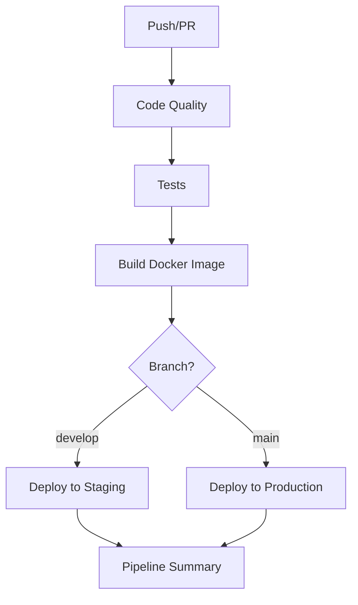

# 🚀 Modular GitHub Actions Workflows

This directory contains a modular CI/CD pipeline broken down into specialized, focused workflows. This approach makes it easier to maintain, debug, and understand each component.

## 📁 Workflow Structure

### 🎯 Main Orchestrator
- **`main.yml`** - Main pipeline orchestrator that calls other workflows

### 🔍 Specialized Workflows
- **`code-quality.yml`** - Code formatting, linting, security scans
- **`test.yml`** - Unit tests, integration tests, coverage reporting
- **`build.yml`** - Docker image building and container security scanning
- **`deploy-simple.yml`** - Deployment to staging/production environments

### 📜 Legacy Workflows
- **`ci-cd.yml`** - Original monolithic workflow (kept for reference)
- **`deploy.yml`** - Original complex deployment workflow

## 🏗️ Pipeline Flow



## ✅ Benefits of Modular Approach

### 🔧 **Maintainability**
- **Single Responsibility**: Each workflow has one clear purpose
- **Easier Debugging**: Issues are isolated to specific components
- **Independent Updates**: Modify one workflow without affecting others

### 🚀 **Reusability**
- **Workflow Calls**: Workflows can be called from other workflows
- **Parameterization**: Pass different inputs for different environments
- **Consistency**: Same workflow logic across multiple triggers

### 📊 **Visibility**
- **Clear Naming**: Easy to identify which component failed
- **Focused Logs**: Smaller, more focused log outputs
- **Better Reporting**: Individual status for each pipeline stage

### ⚡ **Performance**
- **Parallel Execution**: Independent workflows can run in parallel
- **Selective Runs**: Only run necessary workflows based on changes
- **Efficient Caching**: More granular caching strategies

## 🎮 How to Use

### 🔄 Automatic Triggers
The main workflow (`main.yml`) automatically triggers on:
- **Push** to `main` or `develop` branches
- **Pull Requests** to `main` or `develop` branches

### 🎯 Manual Triggers
Individual workflows can be triggered manually:

```bash
# Trigger code quality check only
gh workflow run code-quality.yml

# Trigger tests only
gh workflow run test.yml

# Trigger build only
gh workflow run build.yml
```

### 🔧 Debugging Individual Components

If a specific component fails, you can:

1. **Check the specific workflow logs**
2. **Run only that workflow** to isolate the issue
3. **Fix the issue** without running the entire pipeline
4. **Re-run just that component** to verify the fix

## 📋 Workflow Details

### 🔍 Code Quality (`code-quality.yml`)
- **Black** code formatting check
- **isort** import sorting check  
- **flake8** linting
- **mypy** type checking
- **Bandit** security scanning
- **Safety** dependency vulnerability check

### 🧪 Tests (`test.yml`)
- **Unit Tests** with pytest and coverage
- **Integration Tests** with API testing
- **Services**: PostgreSQL, MongoDB, Redis
- **Coverage Reporting** to Codecov

### 🐳 Build (`build.yml`)
- **Multi-platform** Docker builds (amd64, arm64)
- **Container Security Scanning** with Trivy
- **Image Testing** with basic health checks
- **Registry Push** to GitHub Container Registry

### 🚀 Deploy (`deploy-simple.yml`)
- **Environment-specific** deployments
- **Health Checks** post-deployment
- **Configurable** for different deployment strategies
- **Summary Reporting** with deployment details

## 🔄 Migration from Monolithic

The original `ci-cd.yml` has been preserved for reference. The new modular approach provides:

- ✅ **Same functionality** with better organization
- ✅ **Improved error isolation** and debugging
- ✅ **More flexible** workflow triggers
- ✅ **Better maintainability** for future changes

## 🎯 Next Steps

1. **Test the new workflows** with your repository
2. **Customize deployment logic** in `deploy-simple.yml`
3. **Add environment-specific secrets** in GitHub settings
4. **Remove or archive** old workflows once validated
5. **Extend workflows** as needed for your specific requirements

## 🛠️ Customization

Each workflow can be easily customized:

- **Modify triggers** in the `on:` section
- **Add/remove steps** as needed
- **Change environment variables** in the `env:` section
- **Update secrets** and inputs for your infrastructure

## 📚 Documentation

- [GitHub Actions Documentation](https://docs.github.com/en/actions)
- [Workflow Syntax](https://docs.github.com/en/actions/using-workflows/workflow-syntax-for-github-actions)
- [Reusable Workflows](https://docs.github.com/en/actions/using-workflows/reusing-workflows)
